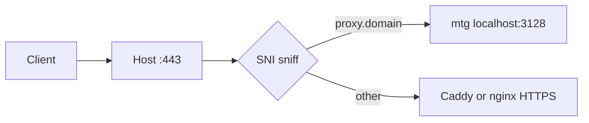

# Telegram MTProto Proxy (Docker)

Docker Compose-обёртка над [mtg](https://github.com/9seconds/mtg) для быстрого развёртывания Telegram MTProto proxy на VPS/VDS — в том числе на серверах с VPN, Caddy и UFW.

**Рекомендуемый способ установки** — интерактивный мастер `./init.sh`: выбор порта, проверка UFW, опциональный домен, генерация секрета и ссылки для Telegram. README — справочник и fallback, если мастер не подходит.

## Быстрый старт

```bash
git clone <repo-url> tg-proxy && cd tg-proxy
chmod +x init.sh scripts/*.sh
./init.sh
```

После завершения мастера вы получите ссылки `tg://proxy?...` и `https://t.me/proxy?...`.

**Если всё прошло успешно:**

```bash
docker compose ps          # STATUS: running
./scripts/doctor.sh        # mtg doctor — DC connectivity OK
./scripts/show-link.sh     # ссылка для клиента
```

В Telegram: **Settings → Data and Storage → Proxy** — вставьте ссылку или настройте server/port/secret вручную.

## Требования

| Компонент | Минимум |
|-----------|---------|
| ОС | Linux (amd64 / arm64) |
| Docker | 20.10+ |
| Docker Compose | v2 (`docker compose`) |
| Права | пользователь в группе `docker`; для UFW — `sudo` |
| Опционально | `gum` (мастер может установить сам), `dig` / `getent` (проверка DNS) |

MTProto использует **только TCP**. UDP открывать не нужно.

## Что делает init-мастер

| Шаг | Действие |
|-----|----------|
| 1 | Проверка Docker и Compose |
| 2 | Сканирование портов, выбор свободного |
| 3 | Домен (опционально) и генерация секрета |
| 4 | Сниппет Caddy/nginx (опционально, SNI на :443) |
| 5 | UFW: проверка и предложение открыть порт |
| 6 | Запись `config/mtg.toml`, `.env` |
| 7 | `docker compose up -d`, `mtg doctor`, вывод ссылки |

Non-interactive режим:

```bash
./init.sh --yes --port 8443 --no-domain
./init.sh --yes --port 443 --domain proxy.example.com --ufw-allow
./init.sh --yes --port 8443 --no-domain --no-start   # только конфиг
```

## Подключение клиента

```bash
./scripts/show-link.sh
```

- **server** — IP (режим без домена) или домен (fake TLS)
- **port** — порт из ссылки (8443, 443 и т.д.)
- **secret** — пароль прокси; **не публикуйте** его в открытых каналах

## Ежедневные команды

```bash
./scripts/show-link.sh          # ссылка для клиента
./scripts/doctor.sh             # диагностика mtg + статус контейнера
docker compose ps               # статус
docker compose logs -f mtg      # логи
docker compose restart mtg      # перезапуск
docker compose down             # остановка
```

## Режимы: с доменом и без

| | Без домена | С доменом |
|---|------------|-----------|
| Секрет | случайный hex (32 символа) | `ee…` (fake TLS, домен в секрете) |
| Server в ссылке | IP сервера | домен |
| DNS | не нужен | A-record → IP сервера |
| Сертификат Let's Encrypt | не нужен | не нужен для mtg |
| Обфускация | базовая | лучше (трафик похож на HTTPS) |
| Рекомендуемый порт | свободный (8443, 4433…) | 443 или SNI-routing |

**Fake TLS:** mtg эмулирует TLS-handshake; клиент Telegram понимает секрет с префиксом `ee`, в котором закодирован домен.

## UFW и файрвол

Мастер предлагает:

```bash
sudo ufw allow PORT/tcp comment 'tg-mtproto'
```

Проверка вручную:

```bash
sudo ufw status | grep PORT
```

**Docker + UFW:** если снаружи не коннектится при «открытом» UFW — Docker может обходить UFW через iptables. Решения:

- [ufw-docker](https://github.com/chaifeng/ufw-docker)
- правила в `/etc/ufw/after.rules`

Не включайте `ufw enable` вслепую — можно потерять SSH-доступ.

## Интеграция с Caddy / nginx (SNI на :443)

Нужно, когда порт 443 занят Caddy/nginx, а MTProto тоже должен быть на 443.



- mtg слушает **127.0.0.1:3128** (режим SNI в мастере)
- UFW открывает **443**, не внутренний порт mtg
- Сниппеты: [reverse-proxy/nginx/stream.conf.example](reverse-proxy/nginx/stream.conf.example), [reverse-proxy/caddy/layer4.caddyfile.example](reverse-proxy/caddy/layer4.caddyfile.example)

**Caddy 2.11:** vanilla-сборка не умеет L4 — нужен [caddy-l4](https://github.com/mholt/caddy-l4) или nginx stream.

Пошагово:

1. `./init.sh` → выбрать домен и «Caddy L4» / «nginx stream»
2. Вставить сниппет в конфиг Caddy/nginx
3. Reload: `sudo nginx -t && sudo systemctl reload nginx` или `caddy reload`
4. `./scripts/doctor.sh`

## Ручная настройка (без init)

```bash
cp .env.example .env
# отредактировать .env
mkdir -p config
cat > config/mtg.toml <<'EOF'
secret = "YOUR_SECRET_HEX"
bind-to = "0.0.0.0:3128"
EOF
docker compose up -d
```

Секрет без домена: `openssl rand -hex 16`  
С доменом: `docker run --rm nineseconds/mtg:2 generate-secret --hex your.domain`

## Переменные окружения

| Переменная | Описание | Пример |
|------------|----------|--------|
| `MTPROTO_HOST_PORT` | Порт публикации Docker на хосте | `8443` |
| `MTPROTO_CLIENT_PORT` | Порт в ссылке для клиента | `8443` или `443` |
| `MTPROTO_BIND_PORT` | Порт внутри контейнера (= bind-to) | `3128` |
| `MTPROTO_PUBLISH_HOST` | Интерфейс публикации | `0.0.0.0` или `127.0.0.1` |
| `MTPROTO_SECRET` | Секрет прокси | `…` |
| `MTPROTO_DOMAIN` | Домен (пусто = IP mode) | `proxy.example.com` |
| `MTPROTO_SERVER` | Адрес для ссылки | IP или domain |
| `MTPROTO_MODE` | `simple` / `faketls` | `simple` |
| `MTPROTO_LINK_TG` | Полная tg:// ссылка | генерируется init |
| `MTPROTO_LINK_HTTPS` | Ссылка t.me/proxy | генерируется init |
| `TZ` | Часовой пояс логов | `Europe/Moscow` |

## Troubleshooting

| Симптом | Возможная причина | Что делать |
|---------|-------------------|------------|
| Telegram не подключается | UFW блокирует | `sudo ufw allow PORT/tcp`, проверить Docker+UFW |
| Порт занят при старте | Конфликт с Caddy/VPN | `./init.sh` или другой порт |
| `mtg doctor` — DC fail | Нет исходящего интернета | `curl -I https://telegram.org`, firewall OUTPUT |
| DNS mismatch warning | A-record ≠ IP сервера | Исправить DNS, подождать TTL |
| Контейнер restart loop | Невалидный secret / TOML | `docker compose logs mtg`, перегенерировать |
| Работает по IP, не по домену | secret без `ee` или DNS | `./init.sh` с доменом |
| SNI на 443 не работает | Caddy без layer4 | nginx stream или отдельный порт |

**Пересоздать конфиг:**

```bash
cp .env .env.bak
cp config/mtg.toml config/mtg.toml.bak
./init.sh
docker compose up -d --force-recreate
```

## Ограничения

- **Нет promo-tag / adtag** — mtg v2 не поддерживает продвижение каналов через @MTProxybot
- **Один секрет на инстанс** — для нескольких секретов: [mtg-multi](https://github.com/dolonet/mtg-multi)
- **Только TCP**
- Сниппеты reverse proxy — справочные; автоматической установки нет

## Структура проекта

```
├── init.sh                 # интерактивный мастер установки
├── docker-compose.yml      # сервис mtg
├── .env.example            # шаблон переменных
├── config/
│   └── mtg.toml            # конфиг mtg (генерируется)
├── lib/                    # модули мастера
├── reverse-proxy/          # сниппеты Caddy/nginx для SNI
└── scripts/
    ├── show-link.sh        # ссылка для клиента
    └── doctor.sh           # диагностика
```

## Безопасность

- `.env` и `config/mtg.toml` содержат secret — не коммитьте, не публикуйте
- Secret = пароль: при компрометации перегенерируйте через `./init.sh` и обновите клиентов
- Init **не изменяет** системные конфиги Caddy/nginx автоматически
- Ограничьте SSH-доступ (ключи, fail2ban)

## Ссылки

- [mtg](https://github.com/9seconds/mtg) — прокси-движок
- [gum](https://github.com/charmbracelet/gum) — TUI для мастера
